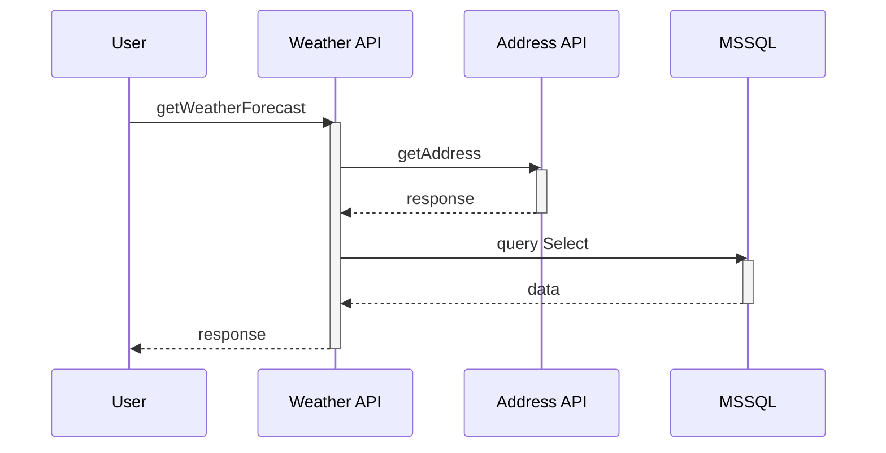

# dls_DotNetTelemetry

Here, you could find an approach to face the Observability patterns for a dotnet application ecosystem. The idea behind is to allow the teams for troubleshooting and helping them with the question, “Why and when is this happening?”. 

With the rise of cloud computing, microservices architectures, and ever-more complex business requirements, the need for Observability has never been greater. Observability is the ability to understand the internal state of a system by examining its outputs.

OpenTelemetry has become the industry standard and it will be the mechanism by which application code is instrumented in the way to fire signals such as traces, metrics, and logs. An application will be properly instrumented when it will not need to add anything else to troubleshoot an issue.

The code was built in .NET Core 6.0 using the official .NET SDK 7.0.201. To make that easier, the toolkit around the application (Grafana, Loki, Jaeger, Prometheus and SQL Server) will be setup using docker containers technology.

## Getting Started

The main idea of the source code hosted in this repository is to expose an API endpoint for retrieving a basic common weather forecast; to achieve telemetry squeezing, the logic inside uses some other external services like a public address API and MSSQL database for building a long path chain of dependencies and thus twist the troubleshooting. 

Please, find below the concept diagram for overview better understanding.



Out of the box .NET gives diagnostics and instrumentation with OpenTelemetry full integrated; take a look for a while in this Microsoft official link https://learn.microsoft.com/en-us/dotnet/core/diagnostics/observability-with-otel

### Solution scaffolding

Please find below the most relevant folders for landing at ease in the source code. As you could check, the solution was built with **Central Package Management**; take a look for a while in this Microsoft official link https://learn.microsoft.com/en-us/nuget/consume-packages/central-package-management):

> **files** <br>
> &nbsp; Directory.Build.props *--> Common build configuration*<br>
> &nbsp; Directory.Packages.props *--> Central package management file*

> **src** <br>
> &nbsp; Telemetry_Receiver *--> Project application*

> **test** <br>
> &nbsp; Telemetry_RecieverFunctionalTests *--> Project to test the Project application features*

Drilling down the **Telemetry_Receiver** project folder tree, you could ckeck how it is based on the dependencies injection principles and how it is burning the extension methods DotNet feature; take a look in this link for digging details https://learn.microsoft.com/en-us/dotnet/csharp/programming-guide/classes-and-structs/extension-methods:

> **Progam.cs** *--> Starting point where the AspNet application is built and services added to the container*<br>
> **Extensions** *--> Services logic over extension methods*<br>
> **Diagnostics** *--> Metrics and logging deffinition*<br>
> **Fetures** *--> Weather forecast endpoint API logic*<br>
> **Infraestructure** *--> Utils for reading config file with database queries*<br>
> **Resources** *--> Database queries file*<br>
> **Options** *--> Options pattern to type settings parameters*<br>

It is important to remark how was improved the logging performance with source generator feature; in DotNet 6 you can create a partial method, decorate it with **[LoggerMessage]** attribute and the source generator will automatically fill in the log. Look into Diagnostics folder to know how it was build or read the Microsoft official link to go ahead https://learn.microsoft.com/en-us/dotnet/core/extensions/logger-message-generator.

### Adding OpenTelemetry

1. Setup the OpenTelemetry library within **AddObservability** method in **ServiceCollectionExtensions** static class:

```c#
// add instrumentation and metrics
services.AddOpenTelemetry()
    .ConfigureResource(configurerResource)
    .WithTracing(tracingBuilder =>
    {
        tracingBuilder
            .AddAspNetCoreInstrumentation()
            .AddHttpClientInstrumentation(options =>
            {
                options.RecordException = hostingEnvironment.IsDevelopment();
            })
            .AddSqlClientInstrumentation(options =>
            {
                options.RecordException = hostingEnvironment.IsDevelopment();
                options.SetDbStatementForText = hostingEnvironment.IsDevelopment();
            })
            .AddSource(nameof(TelemetryReceiver))
            .AddJaegerExporter();

        tracingBuilder.ConfigureServices(setup =>
        {
            setup.Configure<JaegerExporterOptions>(configuration.GetSection("Jaeger"));
        });
    })
    .WithMetrics(metricsBuilder =>
    {
        metricsBuilder
            .AddMeter(nameof(TelemetryReceiver))
            .AddRuntimeInstrumentation()
            .AddAspNetCoreInstrumentation()
            .AddHttpClientInstrumentation()
            .AddProcessInstrumentation()
            .AddPrometheusExporter();
    });

// configure logging ( serilog provider )
loggingBuilder.ClearProviders();
loggingBuilder.AddSerilog(new LoggerConfiguration()
    .ReadFrom.Configuration(configuration)
    .Enrich.FromLogContext()
    .CreateLogger());
```
2. Create the Metric and define the counter and histogram Measures in **TelemetryReceiverDiagnostics** public class:

```c#
private readonly Meter _receiverMeter;

private Counter<long> _httpEventProcessingExceptions = default!;
private Counter<long> _httpEventProcessingCount = default!;
private Histogram<long> _httpEventProcessingTime = default!;

...

_receiverMeter = new Meter(nameof(TelemetryReceiver));

...

private void InitializeCounters(string environmentName)
{
    _httpEventProcessingCount = _receiverMeter.CreateCounter<long>(
        name: TelemetryReceiverConstants.HTTP_EVENT_PROCESSING_COUNT_METRIC_NAME,
        description: TelemetryReceiverConstants.HTTP_EVENT_PROCESSING_COUNT_METRIC_DESCRIPTION);

    _httpEventProcessingExceptions = _receiverMeter.CreateCounter<long>(
        name: TelemetryReceiverConstants.HTTP_EVENT_PROCESSING_EXCEPTIONS_METRIC_NAME,
        description: TelemetryReceiverConstants.HTTP_EVENT_PROCESSING_EXCEPTIONS_METRIC_DESCRIPTION);

    _httpEventProcessingTime = _receiverMeter.CreateHistogram<long>(
        name: TelemetryReceiverConstants.HTTP_EVENT_PROCESSING_TIME_METRIC_NAME,
        description: TelemetryReceiverConstants.HTTP_EVENT_PROCESSING_TIME_METRIC_DESCRIPTION);

    ...
}
```

3. Trigger the diagnostics methods to run the metrics, logs and traces in **GetWeatherForecastDataAsync** method within **WeatherForecastService** public class:

```c#
 public async Task<IEnumerable<GetWeatherForecastResponse>?> GetWeatherForecastDataAsync()
{
    _diagnostics.EventReceived();

    try
    {
        var watchProcesor = Stopwatch.StartNew();

        ...
        
        try
        {
            ...
        }
        catch (Exception exception)
        {
            _diagnostics.ErrorGettingWeatherForecast(exception);
        }
        finally
        {
            ...
        }

        _diagnostics.EventProcessed(watchProcesor.ElapsedMilliseconds, nameof(WeatherForecastService));

        ...
    }
    catch(Exception exception)
    {
        _diagnostics.EventProcessingFailed(exception);
    }

    ...
}
```

## Running the pipeline

As it was mentioned before, the application dummy logic is not relevant here; however, checking its observability capabilities will be the main aim and the tests will be the proper bridge.

There were designed two diferent ways to test the application and the following sections will show you how to run each of them: Running the Telemetry_Receiver from Visual Studio / Running the Telemetry_Receiver from Docker container.

In one way or another, it will be neede to set up the telemetry toolkit with both approaches, in order to show dashboards in Grafana, receive distributed traces in Jaeger, collect metrics with Prometheus and receive logs with Loki.

### Telemetry toolkit

Docker Compose tool was used to provide an easy way to set up a local Grafana, Jaeger, Prometheus, Loki and SqlServer server where to send the telemetry information coming from the weather forecast API application.

This approach helps the way to landing over the observability main tools and allows us to focus on how the source code populates the metrics, distributed traces and logs.

The docker-compose.yml file, within docker folder, build the images for running the containers network and populates the initial database.

Once you get installed Docker Desktop locally https://www.docker.com/products/docker-desktop/, to run the docker compose file it is only needed to run the terminal prompt, place the path where the file is and execute the following command.

```powershell
docker compose -f docker/docker-compose.yaml up --build -d
```

The containers will be ready as soon as you could watch the following result on the prompt command line:

```powershell
[+] Running 6/6
 - Network docker_default                 Created
 - Container docker-jaeger-1              Started
 - Container docker-prometheus-1          Started
 - Container docker-mssql-1               Started
 - Container docker-loki-1                Started
 - Container docker-grafana-1             Started
 ```

You could check how the tools are really up and running browsering the following links:

> **Grafana** --> http://localhost:3000 <br>
> &nbsp; Usr: admin <br>
> &nbsp; Pwd: password1 <br>
> **Jaeger** --> http://localhost:16686 <br>

It is important to remark the friendly way to surf the data when everything is integrated over the same tool like Grafana. By the way, before to consider for promoting to production environment, it will be needed to change the secrets lifecycle.

### Running the Telemetry_Receiver from Visual Studio

The easiest way to check the solution is running the **Telemetry_Receiver** project from Visual Studio directly; in this case, Swagger will be running automatically and you could trigger a weather forecast request directly from it.

### Running the Telemetry_Receiver from Docker container

The application endpoint could also be run using containers technology; for this reason, DockerFile was built for building and executing the application automatically.

```docker
FROM mcr.microsoft.com/dotnet/aspnet:6.0 AS base
WORKDIR /app
EXPOSE 80

FROM mcr.microsoft.com/dotnet/sdk:6.0 AS build
WORKDIR /src
COPY ["dls_DotNetTelemetry/src/Telemetry_Receiver/Telemetry_Receiver.csproj", "src/Telemetry_Receiver/"]
COPY ["dls_DotNetTelemetry/Directory.Build.props", "."]
COPY ["dls_DotNetTelemetry/Directory.Packages.props", "."]
RUN dotnet restore "src/Telemetry_Receiver/Telemetry_Receiver.csproj"

COPY ["dls_DotNetTelemetry/src", "src"]
WORKDIR "/src/src/Telemetry_Receiver"
RUN dotnet build "Telemetry_Receiver.csproj" -c Release -o /app/build

FROM build AS publish
RUN dotnet publish "Telemetry_Receiver.csproj" -c Release -o /app/publish /p:UseAppHost=false

FROM base AS final
WORKDIR /app
COPY --from=publish /app/publish .
COPY ["dls_DotNetTelemetry/src/Telemetry_Receiver/Resources", "/app/Resources/"]
ENTRYPOINT ["dotnet", "Telemetry_Receiver.dll"]
```

Morevoer, it was launch within a docker compose containers network to hands on it as easier as possible; you could take a look in docker-compose-apps.yaml file and run the everything together executing the following command line:

```powershell
docker compose -f docker/docker-compose.yaml -f docker/docker-compose-apps.yaml up --build -d
```

The containers will be ready as soon as you could watch the following result on the prompt command line:

```
[+] Running 7/7
 - Container docker-grafana-1             Created
 - Container docker-telemetry-receiver-1  Started
 - Container docker-prometheus-1          Started
 - Container docker-mssql-1               Started
 - Container docker-jaeger-1              Started
 - Container docker-loki-1                Started
 - Network docker_default                 Started
 ```

You could execute requests to the weather forecast endpoint running the browser and pasting the follwing URL as many times as you would like to fire a new request:

> http://localhost:5050/api/WeatherForecast

## Results

Although there are so many other ways to analyze the telemetry data, Grafana will be the central tool to show the info. Once the login will be made, you could open the Dashboards section and open the default dashboard already loaded within the container start up. The screenshot bellow shows how were populated the custom metrics built in our weather forecast API application after 7 requests.


You could analyze the calling chain and its time tracking going over Jaeger section; here, there will be each request details where the third party HTTP calling endpoint and database connection performance could be splitted for isolated analysis.


Finally, the logs were sent to Loki in real time and you could inspect them accessing to the Loki section in Grafana. 


## Running unit tests

The previous sections focus was to explain the way for providing observability into a web services façade, nevertheless,  this repository also contains a clever approach to run the unit tests, without the need to have the API up in a separate instance of Visual Studio.

As you could check, the project **Telemetry_Receiver.FunctionalTests** is using XUnit as the testing framework and its features were taken advantage. To make it as easier as possible, a health check endpoint was added to the weather forecast endpoint in order to call it avoiding any other third party integration.

The tests with Fluent Assertions was coded into **WeatherForecastControllerTests** public class and the health check endpoint response tested.

```c#
public async Task health_should_work()
{
    var response = await _fixture.TestServer.CreateClient()
        .GetAsync(Api.V1.Configuration.Get.Configuration());

    response.Should()
        .NotBeNull();

    response.StatusCode
        .Should()
        .Be(HttpStatusCode.OK);
}
```

However, the really cool feature is behind the **[Collection(nameof(WeatherForecastServerCollection))]** attribute, where XUnit provides the way to inject a IHost server built in **WeatherForecastServerFixture** public class on which the weather forecast API will run by the Microsoft.AspNet hosting.

```c#
private async Task CreateServerHost()
{
    _host = new HostBuilder()
        .UseEnvironment("Development")
        .ConfigureWebHost(builder =>
        {
            builder
            .ConfigureServices(services => services.AddSingleton<IServer>(serviceProvider => new TestServer(serviceProvider)))
            .UseStartup<TestStartup>();
        })
        .ConfigureAppConfiguration((_, configurationBuilder) =>
        {
            BuildTestconfigurationBuilder(configurationBuilder);
        })
        .Build();

    await _host.StartAsync();

    TestServer = _host.GetTestServer();
}
```

You can execute de test clicking on **Telemetry_Receiver.FunctionalTests** project with secondary button and select Run All Tests menu option. 


## Built With

* [.Net-6.0](https://dotnet.microsoft.com/en-us/download/dotnet/6.0) - The .Net toolkit framework
* [VisualStudio-22](https://visualstudio.microsoft.com/es/vs/community/) - IDE
* [Docker-20.10.13](https://www.docker.com/) - Containers
* [Newtonsoft.Json-13.0.3](https://www.newtonsoft.com/json) - JSON parser
* [Microsoft.Data.SqlClient-5.1.0](https://github.com/dotnet/SqlClient) - MSSQL client
* [OpenTelemetry.Exporter.Console-1.4.0](https://opentelemetry.io/) - OpenTelemetry
* [OpenTelemetry.Exporter.Jaeger-1.4.0](https://opentelemetry.io/) - Jaeger exporter for OpenTelemetry
* [OpenTelemetry.Exporter.Prometheus-1.3.0-rc.2](https://opentelemetry.io/) - Prometheus exporter for OpenTelemetry
* [OpenTelemetry.Exporter.Prometheus.AspNetCore-1.4.0-rc.4](https://opentelemetry.io/) - ASP.Net Core middleware for hosting OpenTelemetry
* [OpenTelemetry.Extensions.Hosting-1.4.0](https://opentelemetry.io/) - 
* [OpenTelemetry.Instrumentation.AspNetCore-1.0.0-rc9.14](https://opentelemetry.io/) - ASP.Net Core instrumentation for OpenTelemetry
* [OpenTelemetry.Instrumentation.Http-1.0.0-rc9.14](https://opentelemetry.io/) - HTTP Core instrumentation for OpenTelemetry
* [OpenTelemetry.Instrumentation.Process-0.5.0-beta.2](https://opentelemetry.io/) - Dotnet process instrumentation for OpenTelemetry
* [OpenTelemetry.Instrumentation.Runtime-1.1.0-rc.2](https://opentelemetry.io/) - Dotnet runtime instrumentation for OpenTelemetry
* [OpenTelemetry.Instrumentation.SqlClient-1.0.0-rc9.14](https://opentelemetry.io/) - SqlClient instrumentation for OpenTelemetry
* [Serilog.AspNetCore-6.1.0](https://github.com/serilog/serilog-aspnetcore) - ASP.Net Core logging integration with Serilog
* [Serilog.Settings.Configuration-3.4.0](https://github.com/serilog/serilog-aspnetcore) - Microsoft.Extensions.Configuration logging integration with Serilog
* [Serilog.Sinks.Console-4.1.0](https://github.com/serilog/serilog-aspnetcore) - A Serilog sink that writes log events to the console/terminal
* [Serilog.Sinks.File-5.0.0](https://github.com/serilog/serilog-aspnetcore) - A Serilog sink that writes log events in plain or JSON format
* [Serilog.Sinks.Grafana.Loki-8.1.0](https://github.com/serilog/serilog-aspnetcore) - A Serilog sink that writes log events to Grafana Loki
* [Swashbuckle.AspNetCore-6.5.0]() - Swagger tools for documentation APIs
* [Dapper-2.0.123](https://github.com/DapperLib/Dapper) - High performance Micro-ORM
* [Xunit-2.4.2](https://github.com/xunit) - Testing framework
* [FluentAssertions-6.10.0](https://fluentassertions.com/) - Testing utility


## Versioning

I use [SemVer](http://semver.org/) for versioning. For the versions available, see the tags on this repository. 
